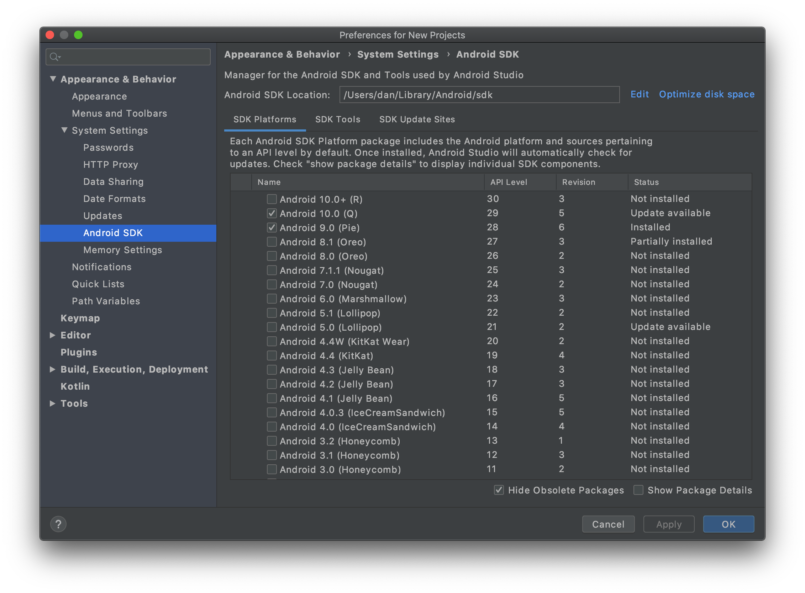

# SkyPortal Mobile

This is the mobile version of the [SkyPortal](https://github.com/skyportal/skyportal) platform. It is built with Ionic
React and is available for both iOS and Android.

## Development requirements and setup

### Node.js and npm

To run the app locally, you will need to have Node.js and npm installed. You can install them
using [nvm](https://github.com/nvm-sh/nvm) or just install a recent version from the [node website](https://nodejs.org/).

### Android Studio

To be able to build the Android version, you will need to have Android Studio installed with the Android SDK and the
Android SDK Platform-Tools. You can follow the instructions [here](https://developer.android.com/studio/install) to
install Android Studio. Then, open Android Studio, go to **Tools -> SDK Manager** and install the latest stable Android
SDK and Android SDK Platform-Tools as shown below 
You will also have to set the ANDROID_HOME environment variable to the path of the Android SDK. You can do that by
setting the ANDROID_HOME variable to your installation path for the Android SDK. You can do it by adding the following line to your `.bashrc` or `.zshrc` file:

```bash
export ANDROID_HOME=<your-installation-path>/Android/Sdk
```

Usually, the default installation path is `/Users/<your-username>/Library/Android/Sdk` on macOS and
`C:\Users\<your-username>\AppData\Local\Android\sdk` on Windows.

### Xcode (macOS only)

To build the iOS version, you will need a macOS computer with Xcode installed. You can install Xcode from
the [App Store](https://apps.apple.com/fr/app/xcode/id497799835).

### Ionic tooling

You will need to have the Ionic CLI installed along with some other dependencies to build the app for devices. You can
install them with the following command:

```bash
npm install -g @ionic/cli native-run cordova-res
```

## Running the app

You're all set! To run the app locally, you can use the following commands:

```bash
npm install
npm run dev:external
```

This will allow you to preview the app directly on your device with hot-reload enabled. It will ask you to choose your
device among a list of connected devices. But you can set your device to be the default one and skip this selection
step. To do that, first get your device ID by running the following command:

```bash
ionic cap run android --list
```

Then, open the `capacitor.config.json` file and set the `device` property to the device ID you just got. Finally, you
can run the following command to preview the app on your device:

If you want to preview the app in a browser, you can use the following command:
```bash
npm run dev
```

Keep in mind that some features might not work as expected in the browser.

## Directory structure
### `src/`
The code is organized in modules. Each module has its own directory in the `src` folder. The modules contain code and components related to the same
feature or group of features. The `lib/` directory contains shared utilities that are used across the app.
### `ios/` and `android/`
These directories contain the native code for the iOS and Android versions of the app. They are generated by Capacitor and should not be modified directly. They have to
be included in the version control system to be able to build the app for iOS and Android.
### `mock/`
This directory contains mock data that is used to develop and test the app without having to connect to a real backend.
### `doc/`
This directory contains documentation and images related to the project.